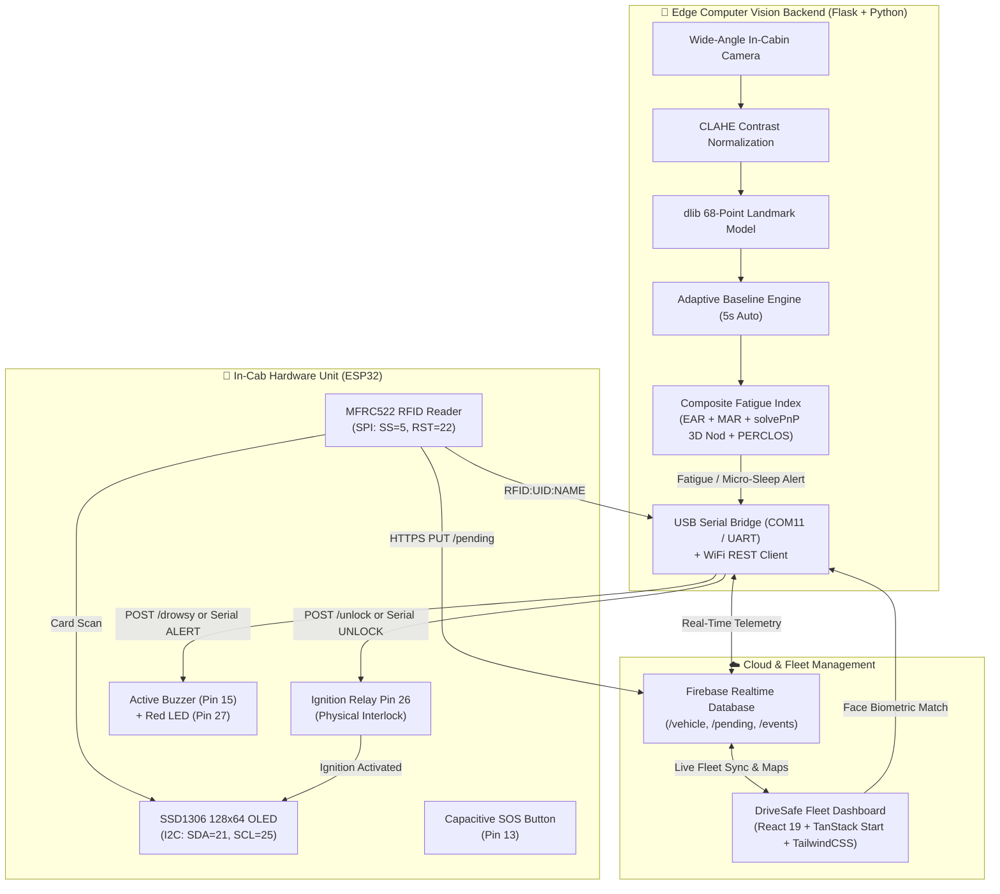
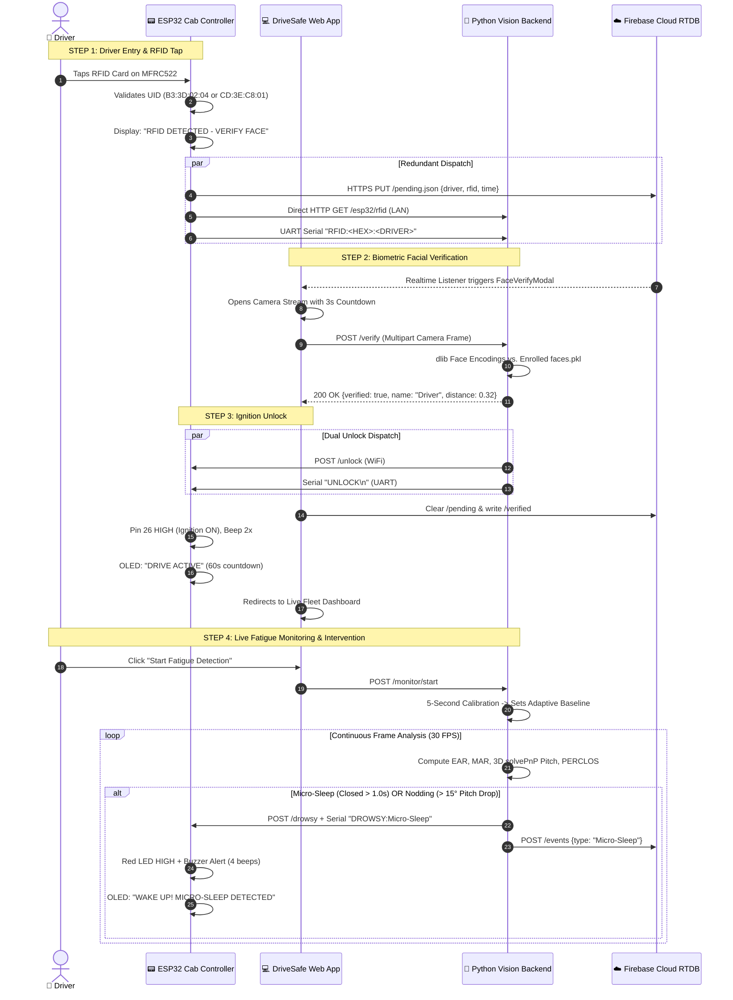
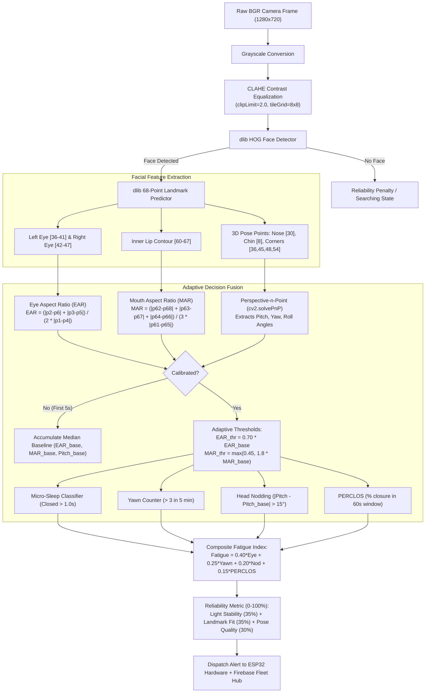

# 🛡️ DriverSentinel — Multi-Factor Driver Safety & Fatigue Detection System

<p align="center">
  
  
  
  
  
</p>

---

## 👥 Team PhantomX

| Member Name | Role & Contribution |
| :--- | :--- |
| **Devyanshu Jasud** | System Architecture, IoT & ESP32 Integration, Full-Stack Pipeline |
| **Swanandi Waghmare** | Computer Vision Models, Facial Landmark Analysis, Calibration |
| **Parth Deshmukh** | Firmware Engineering, Hardware Schematics, Serial Protocol |
| **Gauri Chahakar** | Frontend Dashboard (React/TanStack), Telemetry UI, Testing |

---

## 📌 Executive Summary & Problem Statement (PS-17)

Drowsy driving contributes to over **20% of commercial transport collisions globally**. Traditional driver monitoring systems suffer from critical flaws:
1. **Fixed thresholds** that falsely flag drivers with naturally smaller eyes or glasses.
2. **False alarms** triggered by ordinary rapid blinks.
3. **Lighting failures** under harsh direct sunlight, night darkness, or tunnel glare.
4. **Lack of hardware enforcement**, meaning fatigued drivers are merely warned rather than physically throttled or assisted.

**DriverSentinel** by **Team PhantomX** is an end-to-end mission-critical hardware & software safety ecosystem. It couples **Multi-Factor Driver Authentication (MFA)** with an **Adaptive Multi-Factor Computer Vision Engine** and **Zero-Latency In-Cab Enforcements**.

---

## 🏆 Key Features & Innovations

- 🪪 **Multi-Factor Driver Verification (MFA)**: Vehicle ignition remains locked until an authorized RFID card is tapped **and** the driver's live facial biometrics pass recognition against enrolled fleet records.
- 🎯 **Adaptive Per-Driver Calibration (No Fixed Cutoffs)**: 5-second automatic baseline acquisition adjusts Eye Aspect Ratio (EAR) and Mouth Aspect Ratio (MAR) specifically for the active driver.
- 👁️ **Multi-Factor Fatigue Fusion**:
  - **Prolonged Eye Closure**: Dynamic EAR with micro-sleep classification (>1.0s vs normal <350ms blinks).
  - **PERCLOS Tracking**: Percentage of Eye Closure over a 60-second sliding window.
  - **Excessive Yawning**: Inner-lip MAR tracking with temporal hysteresis.
  - **3D Head Pose Nodding**: Perspective-n-Point (`cv2.solvePnP`) 3D rotational pitch estimation (>15° drop from baseline).
- ☀️ **Lighting Invariant (CLAHE Preprocessing)**: Contrast Limited Adaptive Histogram Equalization normalizes harsh cabin shadows, twilight, and glare.
- ⚡ **Physical Ignition Interlock & Fail-Safe Modes**: ESP32 hardware throttles vehicle to 30 km/h or enforces mandatory 15-minute rest locks if driving thresholds (60s continuous limit) are exceeded.
- 🛰️ **Dual-Path Communication (WiFi + USB Serial Auto-Fallback)**: Operates over LAN/WLAN via RESTful endpoints and automatically falls back to sub-millisecond USB Serial UART (`115200 baud`) if network connection drops.
- 📊 **Real-Time Fleet HUD & Cloud Sync**: Firebase Realtime Database synchronizes vehicle speed, fatigue scores, GPS location, and safety events to fleet headquarters in under 100ms.

---

## 📐 System Architecture



---

## 🔄 Complete Driver Authentication & Enforcement Workflow



---

## 🧮 Computer Vision Algorithm Details



---

## ⚡ Hardware Pinout & Wiring Specifications

| Component | Pin Function | ESP32 GPIO | Description / Protocol |
| :--- | :--- | :--- | :--- |
| **SSD1306 OLED** | SDA | `GPIO 21` | I2C Data (HUD & Speed Limiter) |
| **SSD1306 OLED** | SCL | `GPIO 25` | I2C Clock |
| **MFRC522 RFID** | SS / SDA | `GPIO 5` | SPI Chip Select |
| **MFRC522 RFID** | SCK | `GPIO 18` | SPI Clock |
| **MFRC522 RFID** | MOSI | `GPIO 23` | SPI Master Out Slave In |
| **MFRC522 RFID** | MISO | `GPIO 19` | SPI Master In Slave Out |
| **MFRC522 RFID** | RST | `GPIO 22` | Hardware Reset |
| **Active Buzzer** | Signal | `GPIO 15` | PWM / Digital High Active Alert |
| **Ignition Interlock** | Relay Signal | `GPIO 26` | Physical Ignition Cutoff Circuit |
| **Red Status LED** | Anode (+) | `GPIO 27` | Visual Driver Alert Indicator |
| **SOS Emergency** | Touch / Button | `GPIO 13` | Capacitive Touch / Pull-down Switch |

---

## 📊 PS-17 Compliance Matrix

| PS-17 Criteria | Industry Standard | Team PhantomX DriverSentinel |
| :--- | :--- | :--- |
| **Eye Closure Detection** | Fixed EAR cutoff (fails with squinting) | **Adaptive EAR + 60s Sliding PERCLOS + Blink Filter** |
| **False Alarm Prevention** | Blinks cause alert | **Blinks (<350ms) filtered; only closures >1.0s trigger** |
| **Yawn Detection** | None or simple bounding box | **Inner-lip MAR landmark analysis (hysteresis >2.0s)** |
| **Head Nodding / Slumping** | 2D optical flow | **Full 3D Head Pose Estimation via `solvePnP` (Pitch delta >15°)** |
| **Lighting Tolerance** | Fails in low-light/night | **CLAHE Adaptive Histogram Equalization on Luminance** |
| **Threshold Calibration** | Hardcoded constants | **Dynamic 5-second per-driver automated baseline calibration** |
| **Telemetry & Reliability** | Binary alert only | **Continuous 0–100% Reliability score + Composite Fatigue Index** |
| **Physical Intervention** | Audio beep only | **Physical ignition relay lock, speed throttle to 30 km/h, rest lock** |

---

## 🚀 Quickstart Guide

### 1. Prerequisites
- **Python**: 3.10 to 3.13
- **Node.js**: v18+ or Bun
- **Arduino IDE**: ESP32 Board package installed (v2.x or v3.x)
- **Webcam**: Standard USB or integrated laptop camera

---

### 2. Vision AI Backend Setup
```bash
cd vision-backend

# Install Python requirements
pip install -r requirements.txt

# Download dlib 68-point shape predictor (if not downloaded)
python download_model.py

# Launch the Flask Vision Server
python app.py
```
> The backend boots on `http://0.0.0.0:5000` with serial auto-discovery on `COM11`.

---

### 3. Fleet Dashboard Setup
```bash
cd drivesafe

# Install dependencies
npm install

# Start Vite dev server
npm run dev
```
> Access the modern dashboard at **`http://localhost:8080`**.

---

### 4. ESP32 Firmware Flashing
1. Open [`esp32-firmware/esp32-firmware.ino`](file:///c:/Users/devyt/OneDrive/Documents/engineering%20india/esp32-firmware/esp32-firmware.ino) in **Arduino IDE**.
2. Install required libraries via Library Manager:
   - `Adafruit SSD1306` & `Adafruit GFX`
   - `MFRC522`
3. Edit [`config.h`](file:///c:/Users/devyt/OneDrive/Documents/engineering%20india/esp32-firmware/config.h) if using a different WiFi network:
   ```c
   #define WIFI_SSID     "0110"
   #define WIFI_PASSWORD "devyanshu"
   #define BACKEND_URL   "http://10.73.234.19:5000"
   ```
4. Select Board: **ESP32 Dev Module**, choose the COM port, and click **Upload**.

---

## 💻 API Reference

| Route | Method | Payload / Description |
| :--- | :--- | :--- |
| `/health` | `GET` | System health check (`{"status": "ok"}`) |
| `/verify` | `POST` | Multipart frame; compares against `faces.pkl` enrolled database |
| `/verify/prepare` | `POST` | Temporarily releases OpenCV camera lock for browser webcam |
| `/enroll` | `POST` | Registers new driver face with name and RFID UID |
| `/drivers` | `GET` | Returns list of all authorized enrolled drivers |
| `/monitor/start` | `POST` | Starts real-time multi-factor fatigue detection thread |
| `/monitor/stop` | `POST` | Stops fatigue detection and releases camera resource |
| `/monitor/status`| `GET` | Returns full telemetry (EAR, MAR, Pitch, PERCLOS, Fatigue %, Reliability %) |
| `/monitor/calibrate`| `POST` | Triggers a fresh 5-second baseline re-calibration |
| `/video_feed` | `GET` | MJPEG live video stream with annotated HUD overlay |
| `/esp32/register` | `GET/POST`| Auto-registers dynamic ESP32 IP with Flask backend |
| `/esp32/rfid` | `GET/POST`| Receives direct hardware RFID tap and updates Firebase `/pending` |

---

## 🏆 Innovation Showcase

```
+---------------------------------------------------------------------------------+
|                                TEAM PHANTOMX                                    |
|                       DRIVER SENTINEL CAB HUD v3.0                              |
|                                                                                 |
|  [CAMERA STREAM]             [TELEMETRY]               [HARDWARE STATUS]        |
|  +------------------------+  * Fatigue Index:  14%     * Ignition: ACTIVE (ON)  |
|  |   (o)            (o)   |  * Eye (EAR):      0.318   * ESP32 IP: 10.73.234.178|
|  |          ||            |  * Mouth (MAR):    0.042   * WiFi:     CONNECTED    |
|  |         \__/           |  * Head Pitch:     -2.1 deg* Drive Time: 48s / 60s  |
|  |                        |  * PERCLOS:        2.8%    * Speed:    45 KM/H      |
|  |  STATUS: NORMAL        |  * Reliability:    94%     * Interlock: ARMED       |
|  +------------------------+  * Alert:          CLEAR   * Rest Lock: STANDBY     |
+---------------------------------------------------------------------------------+
```

---

<p align="center">
  <b>Developed with ❤️ for National Safety Innovation by Team PhantomX</b><br/>
  <i>Devyanshu Jasud • Swanandi Waghmare • Parth Deshmukh • Gauri Chahakar</i>
</p>
